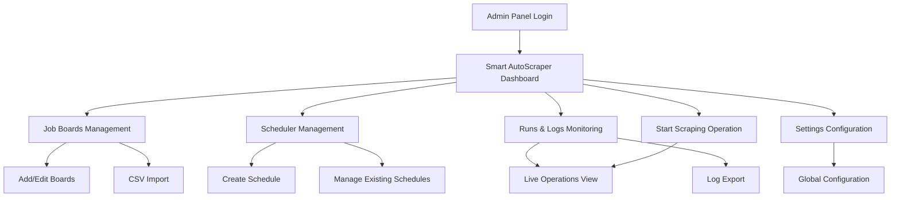

# Smart AutoScraper - Product Requirements Document

## 1. Product Overview

Smart AutoScraper is an indigenous Django-based auto-scraping engine that integrates seamlessly with the existing RemoteHive admin panel to manage large-scale job data ingestion from global job boards. The system primarily extracts job posts from RSS feeds with HTML fallback capabilities, automatically saves raw data, schedules recurring operations, and provides real-time control mechanisms.

The engine addresses the critical need for automated, reliable job data collection across multiple international job boards while maintaining data quality and system performance. It targets job platform administrators who require scalable, maintainable scraping infrastructure with comprehensive monitoring and control capabilities.

## 2. Core Features

### 2.1 User Roles

| Role            | Registration Method                                | Core Permissions                                                                   |
| --------------- | -------------------------------------------------- | ---------------------------------------------------------------------------------- |
| Scraper Manager | Staff user with autoscraper.can\_manage permission | Full control: start/stop/pause/reset operations, edit schedules, manage job boards |
| Scraper Viewer  | Staff user with autoscraper.can\_view permission   | Read-only access: view boards, logs, and scraping statistics                       |

### 2.2 Feature Module

Our Smart AutoScraper system consists of the following main pages:

1. **Dashboard Page**: engine status monitoring, real-time controls (Start, Pause, Resume, Stop, Hard Reset), live statistics display, heartbeat indicators
2. **Job Boards Management**: boards table with search/filter, CSV upload functionality, add/edit board modals, regional categorization
3. **Scheduler Management**: schedule configuration with cron/interval settings, enable/disable controls, next/last run tracking
4. **Runs & Logs Monitoring**: live streaming of scrape operations, progress tracking, error reporting, log export functionality
5. **Settings Configuration**: global rate limiting, user-agent management, retry policies, timeout configurations

### 2.3 Page Details

| Page Name              | Module Name            | Feature description                                                                                     |
| ---------------------- | ---------------------- | ------------------------------------------------------------------------------------------------------- |
| Dashboard Page         | Engine Status Card     | Display current engine state (idle/running/paused), worker count, queue depth, last heartbeat timestamp |
| Dashboard Page         | Control Panel          | Execute scraping operations with mode selection (auto/rss/html), board multiselect, one-click controls  |
| Dashboard Page         | Statistics Overview    | Show total jobs found/saved, success rates, error counts, performance metrics                           |
| Job Boards Management  | Boards Table           | List all job boards with search, region filter, active status toggle, pagination                        |
| Job Boards Management  | CSV Import             | Drag-and-drop CSV upload for bulk board import with validation and progress tracking                    |
| Job Boards Management  | Board Management       | Add/edit board modals with name, base\_url, rss\_url, region, notes fields                              |
| Scheduler Management   | Schedule List          | Display configured schedules with cron/interval, timezone, status, next/last run times                  |
| Scheduler Management   | Schedule Configuration | Create/edit schedules with cron validation, rate limiting, concurrency settings                         |
| Runs & Logs Monitoring | Live Operations Stream | Real-time display of scrape jobs and runs with progress bars, status updates                            |
| Runs & Logs Monitoring | Log Management         | View detailed logs with filtering, search, JSON export functionality                                    |
| Settings Configuration | Global Settings        | Configure rate limits per domain, user-agent strings, retry policies, timeouts                          |

## 3. Core Process

**Scraper Manager Flow:**

1. Manager accesses Smart AutoScraper dashboard from admin panel sidebar
2. Reviews engine status and selects target job boards for scraping
3. Configures scraping mode (auto/rss/html) and initiates scraping operation
4. Monitors real-time progress through live streaming interface
5. Manages schedules for automated recurring scraping operations
6. Reviews logs and exports data for analysis

**Scraper Viewer Flow:**

1. Viewer accesses dashboard with read-only permissions
2. Monitors ongoing scraping operations and system status
3. Reviews historical logs and performance statistics
4. Exports log data for reporting purposes

## 4. User Interface Design

### 4.1 Design Style

* **Primary Colors**: Blue (#3b82f6) for primary actions, Slate (#64748b) for secondary elements

* **Secondary Colors**: Green (#10b981) for success states, Red (#ef4444) for errors, Yellow (#f59e0b) for warnings

* **Button Style**: Rounded corners (rounded-lg), gradient backgrounds for primary actions, solid colors for secondary

* **Font**: Geist Sans for body text (14px-16px), Geist Mono for code/logs (12px-14px)

* **Layout Style**: Card-based design with subtle shadows, top navigation integration with existing admin panel

* **Icons**: Lucide React icons for consistency, status indicators with color-coded badges

### 4.2 Page Design Overview

| Page Name             | Module Name        | UI Elements                                                                                    |
| --------------------- | ------------------ | ---------------------------------------------------------------------------------------------- |
| Dashboard Page        | Engine Status Card | Status pill with color coding (green/blue/red), heartbeat pulse animation, worker count badges |
| Dashboard Page        | Control Panel      | Large action buttons with icons, dropdown selectors, progress indicators during operations     |
| Job Boards Management | Boards Table       | Striped table with hover effects, search input with                                            |

