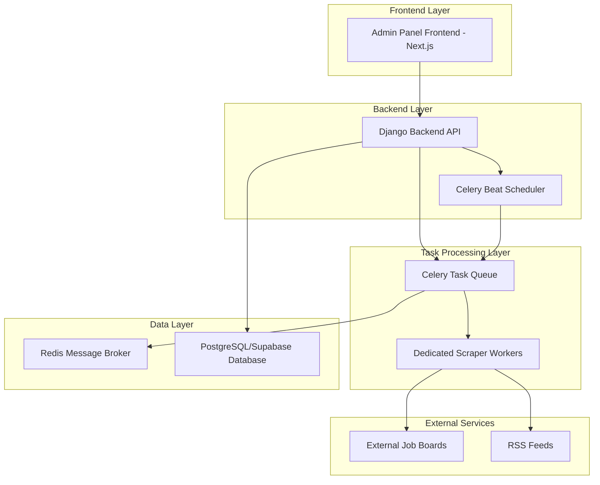
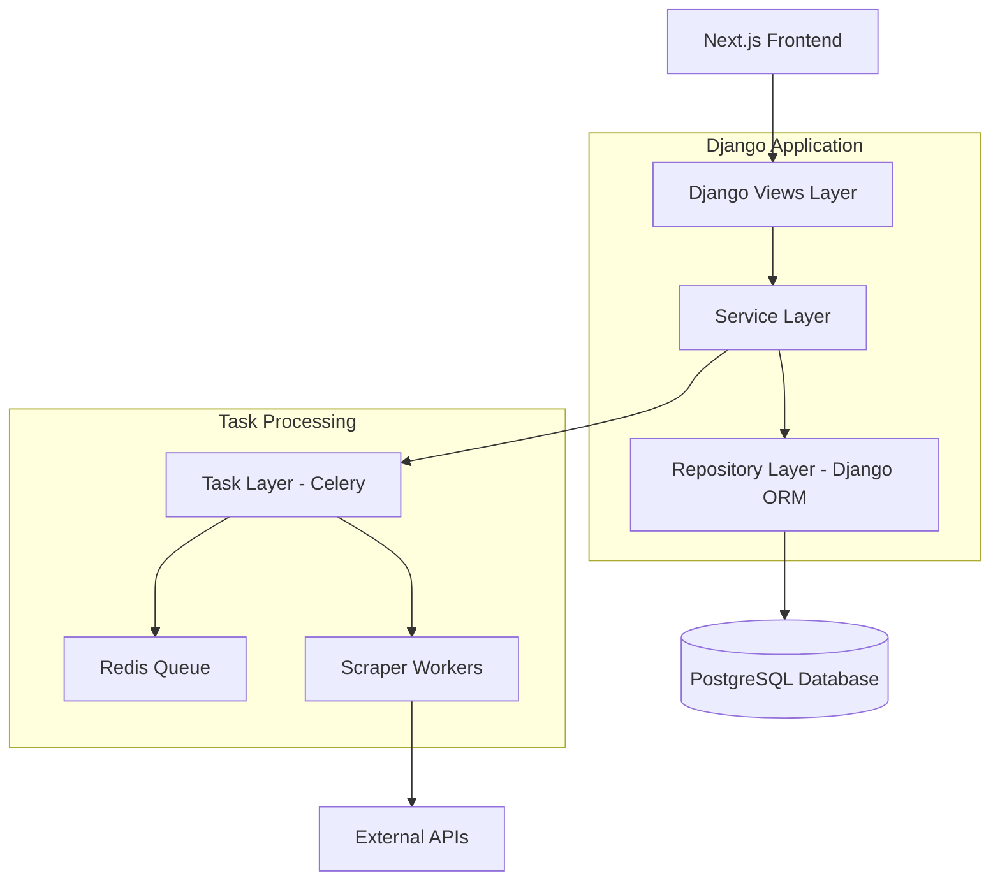
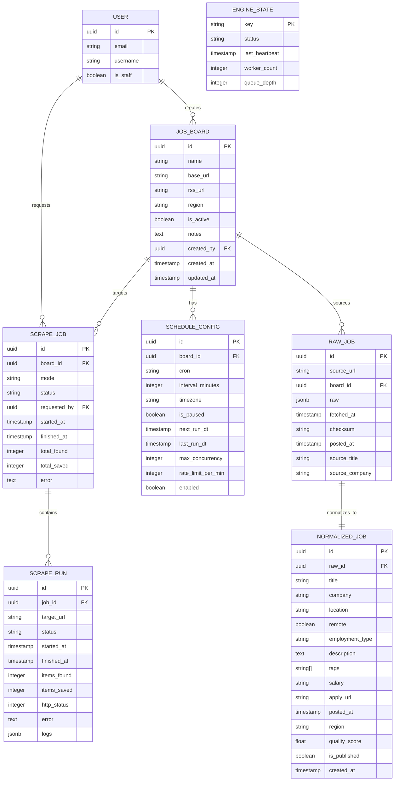

# Smart AutoScraper - Technical Architecture Document

## 1. Architecture Design



## 2. Technology Description

* **Frontend**: Next.js 14 + TypeScript + Tailwind CSS + React Query

* **Backend**: Django 5 + Django REST Framework + PostgreSQL/Supabase

* **Task Processing**: Celery + Redis + Celery Beat

* **Scraping Libraries**: feedparser + requests + BeautifulSoup4 + lxml + dateparser

* **Additional Tools**: tenacity (retries) + pydantic (validation) + tldextract (domain limits) + python-json-logger

## 3. Route Definitions

| Route                               | Purpose                                        |
| ----------------------------------- | ---------------------------------------------- |
| /admin-panel/autoscraper/           | Main dashboard with engine status and controls |
| /admin-panel/autoscraper/boards/    | Job boards management interface                |
| /admin-panel/autoscraper/schedules/ | Scheduler configuration and management         |
| /admin-panel/autoscraper/runs/      | Live operations monitoring and logs            |
| /admin-panel/autoscraper/settings/  | Global configuration settings                  |
| /admin-panel/autoscraper/health/    | System health and status endpoint              |

## 4. API Definitions

### 4.1 Core API

**Job Control Operations**

```
POST /admin-panel/autoscraper/jobs/start
```

Request:

| Param Name | Param Type | isRequired | Description                                           |
| ---------- | ---------- | ---------- | ----------------------------------------------------- |
| board\_id  | UUID       | false      | Specific board to scrape (null for all active boards) |
| mode       | string     | true       | Scraping mode: 'auto', 'rss', or 'html'               |

Response:

| Param Name | Param Type | Description                   |
| ---------- | ---------- | ----------------------------- |
| job\_id    | UUID       | Created scrape job identifier |
| status     | string     | Job status: 'queued'          |
| message    | string     | Operation result message      |

Example:

```json
{
  "board_id": null,
  "mode": "auto"
}
```

**Job Pause/Resume/Stop Operations**

```
POST /admin-panel/autoscraper/jobs/pause
POST /admin-panel/autoscraper/jobs/resume
POST /admin-panel/autoscraper/jobs/stop
```

Request:

| Param Name | Param Type | isRequired | Description           |
| ---------- | ---------- | ---------- | --------------------- |
| job\_id    | UUID       | true       | Target job identifier |

Response:

| Param Name | Param Type | Description              |
| ---------- | ---------- | ------------------------ |
| success    | boolean    | Operation success status |
| status     | string     | Updated job status       |

**Hard Reset Operation**

```
POST /admin-panel/autoscraper/hard-reset
```

Response:

| Param Name | Param Type | Description                |
| ---------- | ---------- | -------------------------- |
| success    | boolean    | Reset operation status     |
| message    | string     | Reset confirmation message |

**Schedule Management**

```
POST /admin-panel/autoscraper/schedules/upsert
```

Request:

| Param Name            | Param Type | isRequired | Description                                                 |
| --------------------- | ---------- | ---------- | ----------------------------------------------------------- |
| board\_id             | UUID       | false      | Target board (null for global schedule)                     |
| cron                  | string     | false      | Cron expression (mutually exclusive with interval\_minutes) |
| interval\_minutes     | integer    | false      | Interval in minutes (mutually exclusive with cron)          |
| timezone              | string     | true       | Timezone identifier (e.g., 'UTC', 'America/New\_York')      |
| rate\_limit\_per\_min | integer    | true       | Rate limit per minute (default: 30)                         |
| max\_concurrency      | integer    | true       | Maximum concurrent operations (default: 2)                  |
| enabled               | boolean    | true       | Schedule enabled status                                     |

**Board Management**

```
POST /admin-panel/autoscraper/boards/import
POST /admin-panel/autoscraper/boards/create
PUT /admin-panel/autoscraper/boards/{board_id}
```

**Health Check**

```
GET /admin-panel/autoscraper/health
```

Response:

| Param Name      | Param Type | Description                                |
| --------------- | ---------- | ------------------------------------------ |
| status          | string     | Engine status: 'idle', 'running', 'paused' |
| worker\_count   | integer    | Active worker count                        |
| queue\_depth    | integer    | Pending tasks in queue                     |
| last\_heartbeat | datetime   | Last engine heartbeat timestamp            |

## 5. Server Architecture Diagram



## 6. Data Model

### 6.1 Data Model Definition



### 6.2 Data Definition Language

**Job Board Table**

```sql
-- Create job_board table
CREATE TABLE autoscraper_jobboard (
    id UUID PRIMARY KEY DEFAULT gen_random_uuid(),
    name VARCHAR(255) NOT NULL,
    base_url VARCHAR(500) NOT NULL,
    rss_url VARCHAR(500),
    region VARCHAR(100) NOT NULL,
    is_active BOOLEAN DEFAULT true,
    notes TEXT,
    created_by_id UUID REFERENCES auth_user(id),
    created_at TIMESTAMP WITH TIME ZONE DEFAULT NOW(),
    updated_at TIMESTAMP WITH TIME ZONE DEFAULT NOW()
);

-- Create indexes
CREATE INDEX idx_jobboard_region ON autoscraper_jobboard(region);
CREATE INDEX idx_jobboard_active ON autoscraper_jobboard(is_active);
CREATE INDEX idx_jobboard_created_by ON autoscraper_jobboard(created_by_id);
```

**Schedule Configuration Table**

```sql
-- Create schedule_config table
CREATE TABLE autoscraper_scheduleconfig (
    id UUID PRIMARY KEY DEFAULT gen_random_uuid(),
    board_id UUID REFERENCES autoscraper_jobboard(id) ON DELETE CASCADE,
    cron VARCHAR(100),
    interval_minutes INTEGER,
    timezone VARCHAR(50) NOT NULL DEFAULT 'UTC',
    is_paused BOOLEAN DEFAULT false,
    next_run_dt TIMESTAMP WITH TIME ZONE,
    last_run_dt TIMESTAMP WITH TIME ZONE,
    max_concurrency INTEGER DEFAULT 2,
    rate_limit_per_min INTEGER DEFAULT 30,
    enabled BOOLEAN DEFAULT true,
    CONSTRAINT check_cron_or_interval CHECK (
        (cron IS NOT NULL AND interval_minutes IS NULL) OR
        (cron IS NULL AND interval_minutes IS NOT NULL)
    )
);

-- Create indexes
CREATE INDEX idx_scheduleconfig_board ON autoscraper_scheduleconfig(board_id);
CREATE INDEX idx_scheduleconfig_enabled ON autoscraper_scheduleconfig(enabled);
CREATE INDEX idx_scheduleconfig_next_run ON autoscraper_scheduleconfig(next_run_dt);
```

**Scrape Job Table**

```sql
-- Create scrape_job table
CREATE TABLE autoscraper_scrapejob (
    id UUID PRIMARY KEY DEFAULT gen_random_uuid(),
    board_id UUID REFERENCES autoscraper_jobboard(id) ON DELETE SET NULL,
    mode VARCHAR(10) NOT NULL CHECK (mode IN ('rss', 'html', 'auto')),
    status VARCHAR(20) NOT NULL DEFAULT 'queued' CHECK (status IN ('queued', 'running', 'paused', 'stopped', 'succeeded', 'failed', 'canceled')),
    requested_by_id UUID REFERENCES auth_user(id),
    started_at TIMESTAMP WITH TIME ZONE,
    finished_at TIMESTAMP WITH TIME ZONE,
    total_found INTEGER DEFAULT 0,
    total_saved INTEGER DEFAULT 0,
    error TEXT
);

-- Create indexes
CREATE INDEX idx_scrapejob_status ON autoscraper_scrapejob(status);
CREATE INDEX idx_scrapejob_board ON autoscraper_scrapejob(board_id);
CREATE INDEX idx_scrapejob_started_at ON autoscraper_scrapejob(started_at DESC);
```

**Raw Job Table**

```sql
-- Create raw_job table
CREATE TABLE autoscraper_rawjob (
    id UUID PRIMARY KEY DEFAULT gen_random_uuid(),
    source_url VARCHAR(1000) UNIQUE NOT NULL,
    board_id UUID REFERENCES autoscraper_jobboard(id) ON DELETE SET NULL,
    raw JSONB NOT NULL,
    fetched_at TIMESTAMP WITH TIME ZONE DEFAULT NOW(),
    checksum CHAR(64) NOT NULL,
    posted_at TIMESTAMP WITH TIME ZONE,
    source_title VARCHAR(500),
    source_company VARCHAR(200),
    UNIQUE(checksum)
);

-- Create indexes
CREATE INDEX idx_rawjob_checksum ON autoscraper_rawjob(checksum);
CREATE INDEX idx_rawjob_posted_at ON autoscraper_rawjob(posted_at DESC);
CREATE INDEX idx_rawjob_board ON autoscraper_rawjob(board_id);
CREATE INDEX idx_rawjob_fetched_at ON autoscraper_rawjob(fetched_at DESC);

-- Create trigram index for title search if pg_trgm is available
CREATE EXTENSION IF NOT EXISTS pg_trgm;
CREATE INDEX idx_rawjob_title_trgm ON autoscraper_rawjob USING gin(source_title gin_trgm_ops);
```

**Engine State Table**

```sql
-- Create engine_state singleton table
CREATE TABLE autoscraper_enginestate (
    key VARCHAR(20) PRIMARY KEY DEFAULT 'autoscraper',
    status VARCHAR(20) NOT NULL DEFAULT 'idle' CHECK (status IN ('idle', 'running', 'paused')),
    last_heartbeat TIMESTAMP WITH TIME ZONE DEFAULT NOW(),
    worker_count INTEGER DEFAULT 0,
    queue_depth INTEGER DEFAULT 0
);

-- Insert initial state
INSERT INTO autoscraper_enginestate (key, status) VALUES ('autoscraper', 'idle')
ON CONFLICT (key) DO NOTHING;
```

**Permissions Setup**

```sql
-- Grant permissions for Supabase
GRANT SELECT ON ALL TABLES IN SCHEMA public TO anon;
GRANT ALL PRIVILEGES ON ALL TABLES IN SCHEMA public TO authenticated;
GRANT USAGE, SELECT ON ALL SEQUENCES IN SCHEMA public TO authenticated;
```

