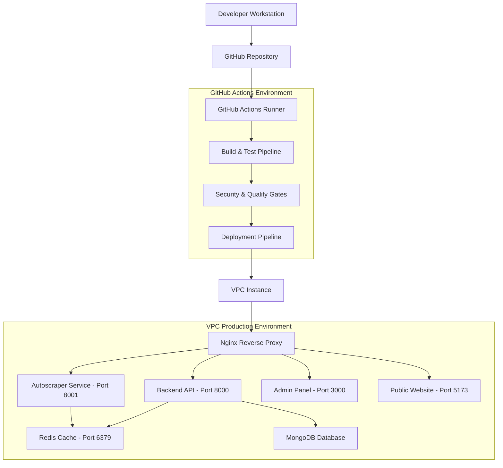
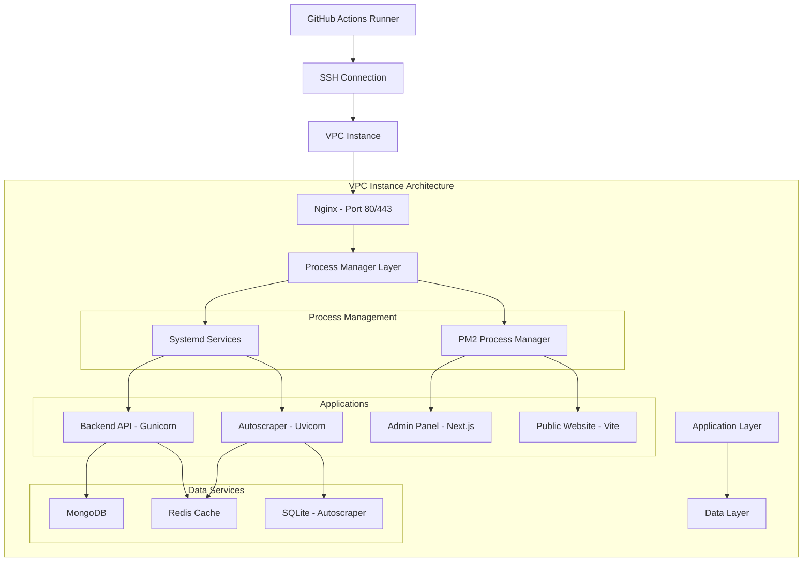
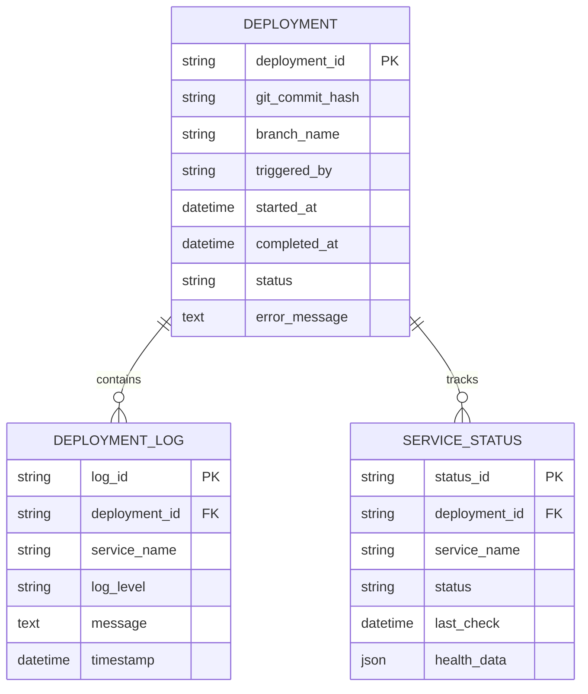

# GitHub Actions CI/CD Technical Architecture for RemoteHive

## 1. Architecture Design



## 2. Technology Description

- **CI/CD Platform**: GitHub Actions with Ubuntu runners
- **Deployment Method**: SSH-based direct deployment to VPC
- **Process Management**: Systemd services with PM2 for Node.js
- **Reverse Proxy**: Nginx for load balancing and SSL termination
- **Monitoring**: Custom health checks with Prometheus metrics
- **Security**: GitHub Secrets, SSH key authentication, automated vulnerability scanning

## 3. Pipeline Definitions

### 3.1 Workflow Triggers

| Trigger | Branch | Environment | Action |
|---------|--------|-------------|--------|
| Push | `main` | Production | Full deployment with health checks |
| Push | `develop` | Staging | Staging deployment with integration tests |
| Pull Request | Any | Preview | Build validation and security scan |
| Schedule | `main` | Production | Nightly security updates and maintenance |
| Manual | Any | Any | On-demand deployment with environment selection |

### 3.2 Pipeline Stages

| Stage | Duration | Purpose | Failure Action |
|-------|----------|---------|----------------|
| Code Quality | 2-3 min | Linting, formatting, static analysis | Block deployment |
| Unit Tests | 3-5 min | Backend and frontend unit tests | Block deployment |
| Security Scan | 2-4 min | Dependency vulnerabilities, code security | Block deployment |
| Build | 5-8 min | Compile applications, generate artifacts | Block deployment |
| Integration Tests | 3-5 min | API tests, service integration | Block deployment |
| Deploy | 3-5 min | SSH deployment to VPC | Automatic rollback |
| Health Check | 1-2 min | Service availability verification | Automatic rollback |
| Notification | 30 sec | Team notification via Slack/email | Log failure |

## 4. API Definitions

### 4.1 Deployment API Endpoints

**Health Check Endpoints**
```
GET /health
```

Response:
| Param Name | Param Type | Description |
|------------|------------|-------------|
| status | string | "healthy" or "unhealthy" |
| timestamp | string | ISO 8601 timestamp |
| services | object | Individual service health status |
| version | string | Current deployment version |

Example:
```json
{
  "status": "healthy",
  "timestamp": "2024-01-15T10:30:00Z",
  "services": {
    "backend": "healthy",
    "autoscraper": "healthy",
    "redis": "healthy",
    "mongodb": "healthy"
  },
  "version": "v1.2.3"
}
```

**Deployment Status API**
```
GET /api/deployment/status
```

Response:
| Param Name | Param Type | Description |
|------------|------------|-------------|
| deployment_id | string | Unique deployment identifier |
| status | string | "in_progress", "completed", "failed" |
| started_at | string | Deployment start timestamp |
| completed_at | string | Deployment completion timestamp |
| services | array | List of deployed services with status |

### 4.2 Webhook Integration

**GitHub Webhook Payload**
```
POST /webhook/github
```

Request:
| Param Name | Param Type | isRequired | Description |
|------------|------------|------------|-------------|
| ref | string | true | Git reference (branch/tag) |
| commits | array | true | List of commits in push |
| repository | object | true | Repository information |
| pusher | object | true | User who triggered the push |

## 5. Server Architecture Diagram



## 6. Data Model

### 6.1 Deployment Tracking Schema



### 6.2 Configuration Management

**Environment Configuration Table**
```sql
CREATE TABLE deployment_config (
    id UUID PRIMARY KEY DEFAULT gen_random_uuid(),
    environment VARCHAR(50) NOT NULL, -- 'production', 'staging', 'development'
    service_name VARCHAR(100) NOT NULL,
    config_key VARCHAR(200) NOT NULL,
    config_value TEXT NOT NULL,
    is_secret BOOLEAN DEFAULT FALSE,
    created_at TIMESTAMP WITH TIME ZONE DEFAULT NOW(),
    updated_at TIMESTAMP WITH TIME ZONE DEFAULT NOW()
);

-- Indexes for performance
CREATE INDEX idx_deployment_config_env_service ON deployment_config(environment, service_name);
CREATE INDEX idx_deployment_config_key ON deployment_config(config_key);
```

**Deployment History Table**
```sql
CREATE TABLE deployment_history (
    id UUID PRIMARY KEY DEFAULT gen_random_uuid(),
    deployment_id VARCHAR(100) UNIQUE NOT NULL,
    git_commit_hash VARCHAR(40) NOT NULL,
    branch_name VARCHAR(100) NOT NULL,
    environment VARCHAR(50) NOT NULL,
    triggered_by VARCHAR(100) NOT NULL,
    status VARCHAR(20) NOT NULL CHECK (status IN ('pending', 'in_progress', 'completed', 'failed', 'rolled_back')),
    started_at TIMESTAMP WITH TIME ZONE NOT NULL,
    completed_at TIMESTAMP WITH TIME ZONE,
    duration_seconds INTEGER,
    error_message TEXT,
    rollback_deployment_id VARCHAR(100),
    created_at TIMESTAMP WITH TIME ZONE DEFAULT NOW()
);

-- Indexes
CREATE INDEX idx_deployment_history_status ON deployment_history(status);
CREATE INDEX idx_deployment_history_env_date ON deployment_history(environment, started_at DESC);
CREATE INDEX idx_deployment_history_commit ON deployment_history(git_commit_hash);
```

**Service Health Monitoring Table**
```sql
CREATE TABLE service_health (
    id UUID PRIMARY KEY DEFAULT gen_random_uuid(),
    service_name VARCHAR(100) NOT NULL,
    environment VARCHAR(50) NOT NULL,
    status VARCHAR(20) NOT NULL CHECK (status IN ('healthy', 'unhealthy', 'degraded', 'unknown')),
    response_time_ms INTEGER,
    cpu_usage_percent DECIMAL(5,2),
    memory_usage_percent DECIMAL(5,2),
    disk_usage_percent DECIMAL(5,2),
    last_deployment_id VARCHAR(100),
    error_count INTEGER DEFAULT 0,
    last_error TEXT,
    checked_at TIMESTAMP WITH TIME ZONE NOT NULL,
    created_at TIMESTAMP WITH TIME ZONE DEFAULT NOW()
);

-- Indexes
CREATE INDEX idx_service_health_service_env ON service_health(service_name, environment);
CREATE INDEX idx_service_health_status ON service_health(status);
CREATE INDEX idx_service_health_checked_at ON service_health(checked_at DESC);
```

## 7. Security and Access Control

### 7.1 GitHub Secrets Management

**Required Secrets**:
- `VPC_HOST`: VPC instance IP address
- `VPC_SSH_KEY`: Private SSH key for VPC access
- `VPC_USERNAME`: SSH username (ubuntu)
- `MONGODB_URI`: MongoDB connection string
- `REDIS_URL`: Redis connection URL
- `JWT_SECRET`: JWT signing secret
- `SLACK_WEBHOOK`: Notification webhook URL

### 7.2 VPC Security Configuration

**Firewall Rules**:
```bash
# Allow SSH (port 22) from GitHub Actions IP ranges
sudo ufw allow from 140.82.112.0/20 to any port 22
sudo ufw allow from 185.199.108.0/22 to any port 22
sudo ufw allow from 192.30.252.0/22 to any port 22

# Allow HTTP/HTTPS traffic
sudo ufw allow 80/tcp
sudo ufw allow 443/tcp

# Deny all other incoming traffic
sudo ufw --force enable
```

### 7.3 Application Security

**Environment Variables**:
```bash
# Production environment variables
export NODE_ENV=production
export PYTHON_ENV=production
export JWT_SECRET_KEY=${JWT_SECRET}
export MONGODB_URL=${MONGODB_URI}
export REDIS_URL=${REDIS_URL}
export CORS_ORIGINS="https://yourdomain.com,https://admin.yourdomain.com"
export RATE_LIMIT_REQUESTS=100
export RATE_LIMIT_WINDOW=60
```

## 8. Monitoring and Alerting

### 8.1 Health Check Implementation

**Backend Health Check**:
```python
# app/api/health.py
from fastapi import APIRouter, Depends
from app.core.database import get_database
from app.core.redis import get_redis
import time

router = APIRouter()

@router.get("/health")
async def health_check(db=Depends(get_database), redis=Depends(get_redis)):
    start_time = time.time()
    
    # Check database connection
    try:
        await db.command("ping")
        db_status = "healthy"
    except Exception:
        db_status = "unhealthy"
    
    # Check Redis connection
    try:
        await redis.ping()
        redis_status = "healthy"
    except Exception:
        redis_status = "unhealthy"
    
    response_time = (time.time() - start_time) * 1000
    
    overall_status = "healthy" if all([
        db_status == "healthy",
        redis_status == "healthy"
    ]) else "unhealthy"
    
    return {
        "status": overall_status,
        "timestamp": time.time(),
        "response_time_ms": round(response_time, 2),
        "services": {
            "database": db_status,
            "redis": redis_status
        }
    }
```

### 8.2 Monitoring Metrics

**Key Performance Indicators**:
- Deployment frequency (deployments per day)
- Lead time (commit to production)
- Mean time to recovery (MTTR)
- Change failure rate
- Service availability (99.9% target)
- Response time (< 200ms target)
- Error rate (< 1% target)

### 8.3 Alerting Rules

**Critical Alerts**:
- Service down for > 2 minutes
- Deployment failure
- Error rate > 5% for > 5 minutes
- Response time > 1000ms for > 5 minutes
- Disk usage > 90%
- Memory usage > 90%

**Warning Alerts**:
- Response time > 500ms for > 10 minutes
- Error rate > 2% for > 10 minutes
- CPU usage > 80% for > 15 minutes
- Disk usage > 80%

## 9. Deployment Automation Scripts

### 9.1 GitHub Actions Workflow

```yaml
# .github/workflows/deploy-production.yml
name: Deploy to Production

on:
  push:
    branches: [ main ]
  workflow_dispatch:
    inputs:
      force_deploy:
        description: 'Force deployment even if tests fail'
        required: false
        default: 'false'

env:
  DEPLOYMENT_ID: ${{ github.sha }}-${{ github.run_number }}

jobs:
  test:
    runs-on: ubuntu-latest
    outputs:
      test_status: ${{ steps.test.outcome }}
    steps:
      - uses: actions/checkout@v3
      
      - name: Set up Python
        uses: actions/setup-python@v4
        with:
          python-version: '3.9'
          
      - name: Set up Node.js
        uses: actions/setup-node@v3
        with:
          node-version: '18'
          
      - name: Cache Python dependencies
        uses: actions/cache@v3
        with:
          path: ~/.cache/pip
          key: ${{ runner.os }}-pip-${{ hashFiles('requirements.txt') }}
          
      - name: Cache Node dependencies
        uses: actions/cache@v3
        with:
          path: ~/.npm
          key: ${{ runner.os }}-node-${{ hashFiles('**/package-lock.json') }}
          
      - name: Install Python dependencies
        run: |
          pip install -r requirements.txt
          pip install pytest pytest-cov
          
      - name: Run Python tests
        id: test
        run: |
          pytest tests/ -v --cov=app --cov-report=xml
          
      - name: Install and test frontend
        run: |
          cd remotehive-admin
          npm ci
          npm run build
          cd ../remotehive-public
          npm ci
          npm run build

  security-scan:
    runs-on: ubuntu-latest
    steps:
      - uses: actions/checkout@v3
      
      - name: Run security scan
        uses: github/super-linter@v4
        env:
          DEFAULT_BRANCH: main
          GITHUB_TOKEN: ${{ secrets.GITHUB_TOKEN }}
          
      - name: Run dependency check
        run: |
          pip install safety
          safety check -r requirements.txt

  deploy:
    needs: [test, security-scan]
    runs-on: ubuntu-latest
    if: needs.test.outputs.test_status == 'success' || github.event.inputs.force_deploy == 'true'
    environment: production
    
    steps:
      - uses: actions/checkout@v3
      
      - name: Create deployment record
        run: |
          echo "Deployment ID: ${{ env.DEPLOYMENT_ID }}"
          echo "Commit: ${{ github.sha }}"
          echo "Branch: ${{ github.ref_name }}"
          echo "Triggered by: ${{ github.actor }}"
          
      - name: Deploy to VPC
        uses: appleboy/ssh-action@v0.1.5
        with:
          host: ${{ secrets.VPC_HOST }}
          username: ${{ secrets.VPC_USERNAME }}
          key: ${{ secrets.VPC_SSH_KEY }}
          script: |
            set -e
            
            # Set deployment variables
            export DEPLOYMENT_ID="${{ env.DEPLOYMENT_ID }}"
            export GIT_COMMIT="${{ github.sha }}"
            export BRANCH_NAME="${{ github.ref_name }}"
            export TRIGGERED_BY="${{ github.actor }}"
            
            # Navigate to application directory
            cd /opt/remotehive
            
            # Create backup
            sudo cp -r /opt/remotehive /opt/remotehive-backup-$(date +%Y%m%d-%H%M%S)
            
            # Update code
            git fetch origin
            git reset --hard origin/main
            
            # Run deployment script
            chmod +x scripts/deploy.sh
            ./scripts/deploy.sh
            
      - name: Health check
        run: |
          sleep 30
          
          # Check all services
          curl -f http://${{ secrets.VPC_HOST }}:8000/health
          curl -f http://${{ secrets.VPC_HOST }}:8001/health
          curl -f http://${{ secrets.VPC_HOST }}:3000
          curl -f http://${{ secrets.VPC_HOST }}:5173
          
      - name: Notify success
        if: success()
        run: |
          curl -X POST -H 'Content-type: application/json' \
            --data '{"text":"✅ RemoteHive deployment successful\nDeployment ID: ${{ env.DEPLOYMENT_ID }}\nCommit: ${{ github.sha }}\nBranch: ${{ github.ref_name }}"}' \
            ${{ secrets.SLACK_WEBHOOK }}
            
      - name: Notify failure and rollback
        if: failure()
        run: |
          # Rollback deployment
          ssh -i <(echo "${{ secrets.VPC_SSH_KEY }}") ${{ secrets.VPC_USERNAME }}@${{ secrets.VPC_HOST }} \
            'cd /opt/remotehive && ./scripts/rollback.sh'
          
          # Send failure notification
          curl -X POST -H 'Content-type: application/json' \
            --data '{"text":"❌ RemoteHive deployment failed and rolled back\nDeployment ID: ${{ env.DEPLOYMENT_ID }}\nCommit: ${{ github.sha }}\nBranch: ${{ github.ref_name }}"}' \
            ${{ secrets.SLACK_WEBHOOK }}
```

### 9.2 VPC Deployment Script

```bash
#!/bin/bash
# scripts/deploy.sh

set -e

echo "🚀 Starting RemoteHive deployment..."
echo "Deployment ID: ${DEPLOYMENT_ID}"
echo "Git Commit: ${GIT_COMMIT}"
echo "Branch: ${BRANCH_NAME}"
echo "Triggered by: ${TRIGGERED_BY}"

# Log deployment start
echo "$(date): Deployment ${DEPLOYMENT_ID} started" >> /var/log/remotehive-deployments.log

# Update Python dependencies
echo "📦 Updating Python dependencies..."
source venv/bin/activate
pip install -r requirements.txt

# Update and build frontend applications
echo "🏗️ Building frontend applications..."
cd remotehive-admin
npm ci --production
npm run build

cd ../remotehive-public
npm ci --production
npm run build

cd ..

# Run database migrations if needed
echo "🗄️ Running database migrations..."
source venv/bin/activate
python -m alembic upgrade head

# Restart services with zero downtime
echo "🔄 Restarting services..."

# Restart backend services
sudo systemctl reload remotehive-backend
sudo systemctl reload remotehive-autoscraper

# Restart frontend services
pm2 reload remotehive-admin
pm2 reload remotehive-public

# Wait for services to start
echo "⏳ Waiting for services to start..."
sleep 15

# Verify all services are running
echo "🔍 Verifying service health..."
for service in remotehive-backend remotehive-autoscraper; do
    if ! systemctl is-active --quiet $service; then
        echo "❌ Service $service is not running"
        exit 1
    fi
done

# Check PM2 processes
if ! pm2 list | grep -q "online.*remotehive-admin"; then
    echo "❌ Admin panel is not running"
    exit 1
fi

if ! pm2 list | grep -q "online.*remotehive-public"; then
    echo "❌ Public website is not running"
    exit 1
fi

# Clear application caches
echo "🧹 Clearing caches..."
redis-cli FLUSHDB

# Log deployment completion
echo "$(date): Deployment ${DEPLOYMENT_ID} completed successfully" >> /var/log/remotehive-deployments.log

echo "✅ Deployment completed successfully!"
echo "🌐 Services are available at:"
echo "   - Backend API: http://localhost:8000"
echo "   - Autoscraper: http://localhost:8001"
echo "   - Admin Panel: http://localhost:3000"
echo "   - Public Website: http://localhost:5173"
```

This technical architecture provides a comprehensive foundation for implementing GitHub Actions CI/CD deployment to replace the current Docker/Kubernetes setup, offering improved simplicity, cost-effectiveness, and automation capabilities.