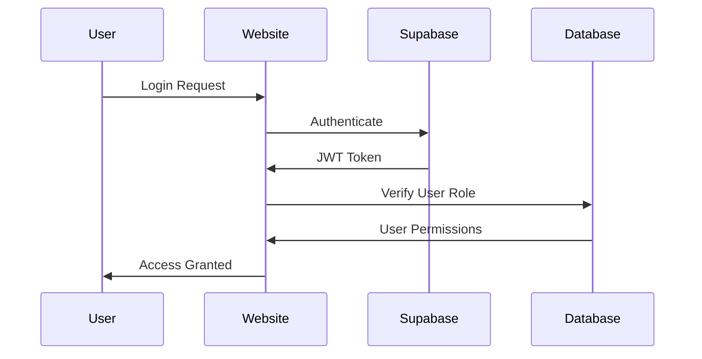
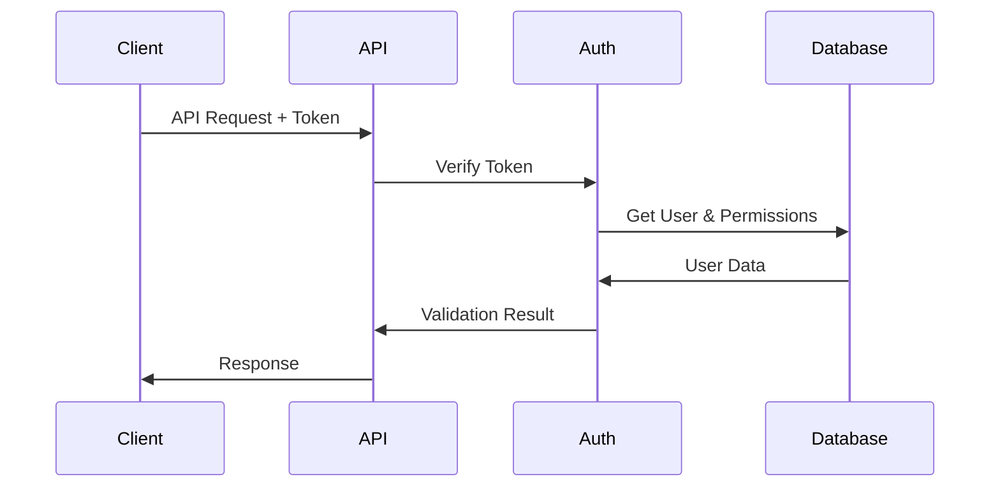
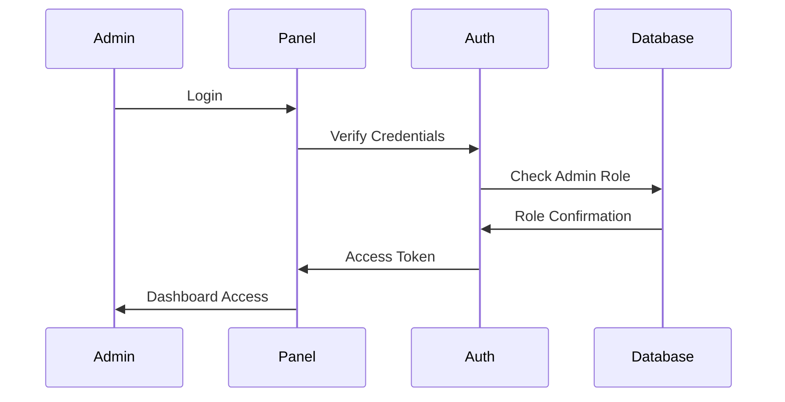

# RemoteHive Comprehensive Authentication System

## Overview

This document outlines the comprehensive authentication and authorization system for RemoteHive, detailing how job seekers, employers, and admin panel users interact across the API server, admin panel, and public website.

## System Architecture

### Core Components

1. **Supabase Authentication** - Primary authentication provider
2. **Custom JWT Tokens** - Fallback authentication mechanism
3. **Role-Based Access Control (RBAC)** - Permission management
4. **Platform-Specific Access Control** - Cross-platform authorization
5. **Session Management** - Token lifecycle management
6. **Audit Logging** - Security and compliance tracking

## User Roles and Permissions

### 1. Job Seekers (`job_seeker`)

**Platform Access:**
- ✅ Public Website (Full Access)
- ✅ API Server (Limited Access)
- ❌ Admin Panel (No Access)

**Permissions:**
- View job listings
- Apply for jobs
- Manage profile
- Upload resume/documents
- View application status
- Receive notifications

**API Endpoints:**
- `GET /api/jobs` - Browse job listings
- `POST /api/applications` - Submit job applications
- `GET /api/profile` - View own profile
- `PUT /api/profile` - Update profile
- `GET /api/applications/me` - View own applications

### 2. Employers (`employer`)

**Platform Access:**
- ✅ Public Website (Full Access)
- ✅ API Server (Extended Access)
- ✅ Admin Panel (Limited Access - Employer Dashboard)

**Permissions:**
- Post job listings
- Manage company profile
- Review applications
- Contact job seekers
- Access analytics
- Manage team members

**API Endpoints:**
- `POST /api/jobs` - Create job listings
- `GET /api/jobs/company/{id}` - View company jobs
- `GET /api/applications/job/{id}` - View job applications
- `PUT /api/applications/{id}/status` - Update application status
- `GET /api/analytics/company` - Company analytics

### 3. Admin (`admin`)

**Platform Access:**
- ✅ Public Website (Full Access)
- ✅ API Server (Full Access)
- ✅ Admin Panel (Full Access)

**Permissions:**
- Manage all users
- Moderate content
- View system analytics
- Manage job listings
- Handle disputes
- Configure system settings

**API Endpoints:**
- `GET /api/admin/users` - Manage users
- `GET /api/admin/jobs` - Manage all jobs
- `GET /api/admin/analytics` - System analytics
- `POST /api/admin/notifications` - Send notifications
- `PUT /api/admin/settings` - Update settings

### 4. Super Admin (`super_admin`)

**Platform Access:**
- ✅ Public Website (Full Access)
- ✅ API Server (Full Access)
- ✅ Admin Panel (Full Access + System Management)

**Permissions:**
- All admin permissions
- Manage admin users
- System configuration
- Database management
- Security settings
- Backup/restore operations

## Database Schema

### Enhanced Users Table

```sql
CREATE TABLE users (
    id UUID PRIMARY KEY DEFAULT gen_random_uuid(),
    email VARCHAR(255) UNIQUE NOT NULL,
    role user_role_enum NOT NULL DEFAULT 'job_seeker',
    
    -- Platform Access Flags
    can_access_public_site BOOLEAN DEFAULT true,
    can_access_admin_panel BOOLEAN DEFAULT false,
    can_access_api BOOLEAN DEFAULT true,
    
    -- Account Status
    is_active BOOLEAN DEFAULT true,
    is_verified BOOLEAN DEFAULT false,
    
    -- Timestamps
    created_at TIMESTAMP WITH TIME ZONE DEFAULT NOW(),
    updated_at TIMESTAMP WITH TIME ZONE DEFAULT NOW(),
    last_login TIMESTAMP WITH TIME ZONE
);
```

### Role Permissions Table

```sql
CREATE TABLE role_permissions (
    id UUID PRIMARY KEY DEFAULT gen_random_uuid(),
    role user_role_enum NOT NULL,
    permission_name VARCHAR(100) NOT NULL,
    resource VARCHAR(100) NOT NULL,
    action VARCHAR(50) NOT NULL,
    platform platform_enum NOT NULL,
    is_granted BOOLEAN DEFAULT true,
    created_at TIMESTAMP WITH TIME ZONE DEFAULT NOW()
);
```

### Platform Access Table

```sql
CREATE TABLE platform_access (
    id UUID PRIMARY KEY DEFAULT gen_random_uuid(),
    user_id UUID REFERENCES users(id) ON DELETE CASCADE,
    platform platform_enum NOT NULL,
    access_level access_level_enum NOT NULL DEFAULT 'read',
    is_active BOOLEAN DEFAULT true,
    granted_by UUID REFERENCES users(id),
    granted_at TIMESTAMP WITH TIME ZONE DEFAULT NOW(),
    expires_at TIMESTAMP WITH TIME ZONE
);
```

## Cross-Platform Authentication Flow

### 1. Public Website Authentication



### 2. API Server Authentication



### 3. Admin Panel Authentication



## Permission Matrix

| Resource | Job Seeker | Employer | Admin | Super Admin |
|----------|------------|----------|-------|-------------|
| **Public Website** |
| Browse Jobs | ✅ | ✅ | ✅ | ✅ |
| Apply for Jobs | ✅ | ❌ | ✅ | ✅ |
| Post Jobs | ❌ | ✅ | ✅ | ✅ |
| **API Server** |
| User Profile | Own Only | Own Only | All | All |
| Job Management | View Only | Own Jobs | All Jobs | All Jobs |
| Applications | Own Only | Received Only | All | All |
| Analytics | None | Company Only | System | System |
| **Admin Panel** |
| User Management | ❌ | Limited | ✅ | ✅ |
| Content Moderation | ❌ | Own Content | ✅ | ✅ |
| System Settings | ❌ | ❌ | Limited | ✅ |
| Database Access | ❌ | ❌ | ❌ | ✅ |

## Security Features

### 1. Multi-Factor Authentication
- Email verification required
- Optional SMS verification
- TOTP support for admin users

### 2. Session Management
- JWT token expiration
- Refresh token rotation
- Session invalidation on logout
- Concurrent session limits

### 3. Audit Logging
- All authentication attempts
- Permission changes
- Sensitive data access
- Administrative actions

### 4. Rate Limiting
- Login attempt limits
- API request throttling
- IP-based restrictions
- User-based quotas

## Implementation Files

### Core Authentication Files
- `backend/core/auth.py` - Authentication logic
- `backend/core/database.py` - Database connections
- `backend/schemas/user.py` - User data models
- `comprehensive_auth_roles_table.sql` - Database schema

### Configuration Files
- `backend/core/config.py` - Environment settings
- `backend/core/security.py` - Security utilities

### API Endpoints
- `backend/api/auth.py` - Authentication endpoints
- `backend/api/users.py` - User management
- `backend/api/admin.py` - Admin operations

## Troubleshooting Common Issues

### 1. "Could not validate credentials" Error
**Cause:** Mismatch between Supabase user ID and database user ID
**Solution:** Ensure user exists in both Supabase Auth and users table

### 2. "Access denied" for Admin Panel
**Cause:** User role not set to 'admin' or 'super_admin'
**Solution:** Update user role in database and verify `can_access_admin_panel` flag

### 3. API Authentication Failures
**Cause:** Invalid or expired JWT tokens
**Solution:** Implement token refresh mechanism and proper error handling

### 4. Cross-Platform Session Issues
**Cause:** Inconsistent session management across platforms
**Solution:** Centralize session storage and implement proper logout flows

## Next Steps

1. **Manual Supabase Setup:**
   - Execute `comprehensive_auth_roles_table.sql` in Supabase SQL Editor
   - Verify all tables are created successfully
   - Set up Row Level Security (RLS) policies

2. **Update Application Code:**
   - Modify authentication middleware
   - Update permission checking functions
   - Implement new session management

3. **Testing:**
   - Test all user roles across platforms
   - Verify permission enforcement
   - Test authentication flows

4. **Documentation:**
   - Update API documentation
   - Create user guides for each role
   - Document admin procedures

## 🔐 Admin Credentials

**IMPORTANT: Single Admin Account**

There is only ONE admin credential for accessing the system:

- **Email:** `admin@remotehive.in`
- **Password:** `Ranjeet11$`
- **Role:** `super_admin`

This credential provides access to:
- Admin panel at `/admin`
- All administrative API endpoints
- User management and system configuration
- Full system access including database management

**Note:** All other admin credentials (especially any with `.com` domains) have been removed from the system.

## Contact and Support

For technical issues or questions about the authentication system:
- Review the audit logs in `user_audit_log` table
- Check security events in `security_events` table
- Consult the permission matrix above
- Test with the provided scripts
- Use admin credentials: `admin@remotehive.in` / `Ranjeet11$`

---

*This document should be updated as the authentication system evolves and new features are added.*